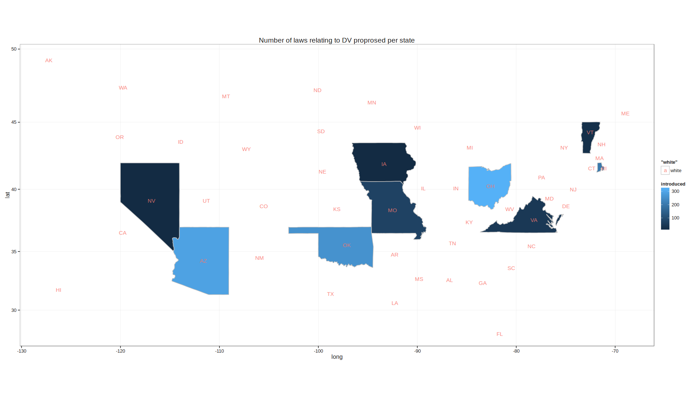

Urban Data Dive: How Better Data Can Reduce Domestic Violence
=============================================================

Overview
--------

Load data
---------

### Data Sources

``` {.r}
library(dplyr)
library(ggplot2)
library(maps)
```

``` {.r}
# load state data
dat = map_data('state')

# load state dv legislature data
state_dv_legislature = tbl_df(read.csv('input/state_dv_legislature.csv')) %>%
    filter(region != 'us congress')

# state abbreviations
states = data.frame(state.center, state.abb)

# combine data
dat = merge(dat, state_dv_legislature, by='region')
dat = arrange(dat, order)

plt = ggplot(data=dat, aes(x = long, y = lat, group = group))
plt = plt + geom_polygon(aes(fill=introduced))
plt = plt + geom_path(colour = 'gray', linestyle = 2)
plt = plt + coord_map()
plt = plt + geom_text(data=states, aes(x=x, y=y, label=state.abb, group = NULL, color='white'), size = 2)
plt = plt + theme_bw()
plt
```


